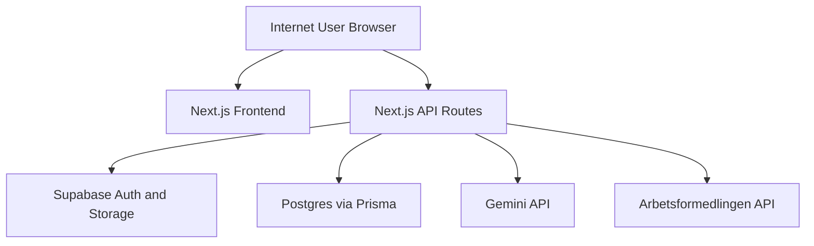

## Assumption-Validation Check-In
- This repository is an internet-facing web app, deployed on Vercel, with Supabase session-cookie authentication.
- User-uploaded CV/personal-letter documents may contain sensitive personal data (PII and employment history).
- State-changing API calls are made from same-origin browser sessions using cookies rather than explicit bearer tokens.
- API routes under `/app/api` are publicly reachable unless blocked by route-level authentication checks.
- Security headers may be configured at edge/platform level, but no explicit header policy is visible in this repo.

### Targeted Context Questions
1. Is this service exposed publicly on the internet today, or only for internal/testing users?
2. Are Supabase auth cookies configured with strict CSRF mitigations outside this repo (WAF/edge/origin checks)?
3. Do you have production rate limits/WAF rules already enforcing auth and LLM endpoint throttling?

Proceeding with explicit assumptions above because this was requested as a single-pass full check.

## Executive summary
Top risks cluster around request-boundary protections rather than broken object authorization. The highest-priority threats are forged state-changing requests in authenticated sessions (CSRF class), abuse of unthrottled auth/LLM endpoints for brute force and cost DoS, and unbounded content processing paths that can amplify availability impact.

## Scope and assumptions
- In scope:
  - `app/api/**`
  - `app/auth/callback/route.ts`
  - `lib/services/**`
  - `lib/supabase/**`
  - `next.config.mjs`, `middleware.ts`, `prisma/schema.prisma`
- Out of scope:
  - Supabase hosted controls and project-level dashboard settings
  - Vercel edge/network policy configuration not stored in repo
  - Third-party provider internal security controls (Gemini, Arbetsformedlingen)
- Open questions that materially affect risk ranking:
  - Existing edge/WAF CSRF/origin protections
  - Existing edge/API rate limiting
  - Intended production audience scale and traffic profile

## System model
### Primary components
- Browser client and Next.js App Router frontend (`app/**`, `components/**`).
- Next.js route handlers for application APIs (`app/api/**`).
- Supabase auth/session and storage access (`lib/supabase/server.ts`, `lib/storage.ts`).
- Prisma-backed Postgres data model (`prisma/schema.prisma`).
- External APIs: Arbetsformedlingen jobs API and Google Gemini API (`lib/services/arbetsformedlingen.ts`, `lib/services/gemini.ts`).

### Data flows and trust boundaries
- Internet User -> Next.js Route Handlers (`app/api/**`)
  - Data: JSON payloads, multipart file uploads, cookies.
  - Channel: HTTPS.
  - Guarantees: route-level auth checks in most handlers (`supabase.auth.getUser()`), Zod schema checks on some endpoints.
  - Gaps: no visible CSRF token/origin verification on state-changing routes.
- Next.js Route Handlers -> Supabase Auth/Storage (`lib/supabase/server.ts`, `lib/storage.ts`)
  - Data: session cookies, file objects, signed URL requests.
  - Channel: provider SDK over HTTPS.
  - Guarantees: authenticated session lookup and user-scoped storage paths.
- Next.js Route Handlers -> Postgres via Prisma (`prisma/schema.prisma`)
  - Data: documents, saved jobs, generated letters, skills metadata.
  - Channel: DB connection from server environment.
  - Guarantees: application-level ownership checks in route handlers.
- Next.js Route Handlers -> External APIs (`lib/services/gemini.ts`, `lib/services/arbetsformedlingen.ts`)
  - Data: prompt content including CV/job text; job query parameters.
  - Channel: outbound HTTPS.
  - Guarantees: fixed base URL for jobs API; API keys in server env.
  - Gaps: limited abuse controls for expensive LLM operations.

#### Diagram

## Assets and security objectives
| Asset | Why it matters | Security objective (C/I/A) |
|---|---|---|
| User documents (CV/personal letters) | Contains personal data and career history | C, I |
| Session/auth cookies | Grants account access to user data and mutations | C, I |
| Generated letters and saved jobs | Core user data and app value | C, I |
| Gemini API budget and quota | Abuse can create direct cost and service degradation | A |
| Database integrity (user/document relations) | Prevents cross-user data corruption or unauthorized changes | I |
| Signed storage URLs | Controls short-lived access to stored files | C |

## Attacker model
### Capabilities
- Remote unauthenticated attacker can call internet-exposed routes.
- Remote attacker can trick logged-in users into visiting attacker-controlled pages (cross-site request scenarios).
- Authenticated attacker can call own-account endpoints repeatedly to stress compute/storage/LLM budget.

### Non-capabilities
- Attacker cannot directly read server environment variables from this codebase.
- Attacker cannot directly bypass per-resource ownership checks where userId checks are enforced.
- Attacker cannot select arbitrary outbound host in jobs API integration (fixed base URL).

## Entry points and attack surfaces
| Surface | How reached | Trust boundary | Notes | Evidence (repo path / symbol) |
|---|---|---|---|---|
| `/api/upload` POST | Browser multipart upload | User -> API | Stores files and parses content | `app/api/upload/route.ts` |
| `/api/generate` POST | Authenticated UI action | User -> API -> Gemini | Creates generated letters; LLM-cost path | `app/api/generate/route.ts` |
| `/api/skills` POST/PATCH | Authenticated UI action | User -> API -> Gemini/DB | Mutates document skill data | `app/api/skills/route.ts` |
| `/api/skills/batch` POST | Authenticated UI action | User -> API -> Gemini | Iterates all CVs; high amplification potential | `app/api/skills/batch/route.ts` |
| `/api/documents/[id]` PATCH/DELETE | Authenticated UI action | User -> API -> DB/Storage | Data mutation and deletion | `app/api/documents/[id]/route.ts` |
| `/api/auth/signin` POST | Public login endpoint | User -> API -> Supabase | Brute-force target | `app/api/auth/signin/route.ts` |
| `/auth/callback` GET | OAuth/email callback redirect | User -> API | Redirect handling and session exchange | `app/auth/callback/route.ts` |

## Top abuse paths
1. CSRF mutation path:
   - Attacker hosts malicious page -> victim with active session loads page -> browser submits forged POST/DELETE to mutation endpoint -> account data changed/deleted.
2. Auth brute-force pressure:
   - Attacker scripts repeated login attempts -> no visible throttling -> elevated account takeover probability and auth backend strain.
3. LLM cost-amplification:
   - Authenticated attacker repeatedly calls `/api/generate` and `/api/skills/batch` -> high outbound API usage -> quota exhaustion/cost spike.
4. Oversized document-update DoS:
   - Authenticated attacker sends very large `parsedContent` to PATCH -> large buffers/storage writes -> degraded response times and cost increase.
5. Upload type spoofing:
   - Attacker crafts payload with allowed client MIME type but unexpected content -> unsafe parse/storage behavior increases attack surface.
6. Secondary phishing flow via unbounded `next` redirect path:
   - Attacker sends user crafted callback URL with unexpected path -> user lands on attacker-chosen in-app path post-auth, increasing social-engineering leverage.

## Threat model table
| Threat ID | Threat source | Prerequisites | Threat action | Impact | Impacted assets | Existing controls (evidence) | Gaps | Recommended mitigations | Detection ideas | Likelihood | Impact severity | Priority |
|---|---|---|---|---|---|---|---|---|---|---|---|---|
| TM-001 | Cross-site attacker | Victim has active authenticated browser session | Forge POST/PATCH/DELETE requests to cookie-auth endpoints | Unauthorized account mutations/deletions | User documents, saved jobs, generated letters, session trust | Route auth checks exist (`app/api/upload/route.ts:13`, `app/api/documents/[id]/route.ts:57`) | No explicit CSRF token or Origin/Referer checks | Add CSRF token strategy + strict Origin/Referer validation on all mutation routes | Log/reject invalid origins, monitor sudden cross-origin rejection spikes | Medium | High | high |
| TM-002 | Remote automated attacker | Public access to sign-in route | Credential stuffing / brute-force at login | Account takeover probability increase and auth service degradation | Accounts, session artifacts, availability | Input schema validation (`app/api/auth/signin/route.ts:5`) | No visible per-IP/account throttling or lockout | Add layered rate limits, temporary lockouts, anomaly detection | Track failed-login rates per IP/user and alert on spikes | High | Medium | high |
| TM-003 | Authenticated abusive user | Valid account session | Repeated expensive LLM calls via generate/skills endpoints | Cost spike, quota exhaustion, degraded service | API budget, availability-critical compute | Auth checks on endpoints (`app/api/generate/route.ts:16`, `app/api/skills/batch/route.ts:31`) | No visible quotas/throttling/circuit breaker | Per-user and per-IP quotas, request budgets, async job queue for batch operations | Metric and alert on token usage and request rate per user | High | Medium | high |
| TM-004 | Authenticated attacker | Valid account session | Send oversized `parsedContent` to document PATCH | Memory/storage amplification and potential latency/DoS | Availability, storage cost, DB integrity | Ownership check before update (`app/api/documents/[id]/route.ts:96`) | No max size bound before buffer conversion and DB write | Enforce strict payload size cap and reject with `413`; cap DB field length at app layer | Monitor payload sizes, response latency, and write errors | Medium | Medium | medium |
| TM-005 | Authenticated attacker | Can upload files | MIME spoofing or malformed file upload into parser/storage paths | Expanded parser attack surface and malicious content persistence | Storage integrity, availability | MIME allowlist + size cap (`app/api/upload/route.ts:51`, `app/api/upload/route.ts:61`) | No server-side signature validation or scanning | Add magic-byte checks, optional AV scan, parser isolation/timeouts | Monitor parser errors and unusual MIME/signature mismatches | Medium | Medium | medium |
| TM-006 | Social-engineering attacker | User follows crafted callback URL | Controls post-auth `next` path for redirection | User steering to unexpected internal route after auth | User trust/session workflow integrity | Redirect anchored to origin (`app/auth/callback/route.ts:14`) | No allowlist/normalization of `next` destination | Restrict `next` to relative allowlisted paths | Log unexpected `next` values and high-entropy query payloads | Low | Low | low |

## Criticality calibration
- Critical:
  - Remote unauthenticated account takeover at scale.
  - Cross-tenant/user data exfiltration across authorization boundaries.
  - Pre-auth RCE in parser/upload path.
- High:
  - Forged authenticated mutations without user intent (CSRF class).
  - Sustained brute-force on auth without guardrails.
  - LLM endpoint abuse that materially degrades service/cost.
- Medium:
  - Authenticated user-driven DoS via oversized payloads.
  - Malicious file persistence without signature/scanning controls.
  - Missing defense-in-depth headers where no edge policy exists.
- Low:
  - Internal-path redirect steering after auth callback.
  - Low-sensitivity info disclosure from generic endpoint errors.
  - Non-security preference cookies lacking stricter attributes.

## Focus paths for security review
| Path | Why it matters | Related Threat IDs |
|---|---|---|
| `app/api/upload/route.ts` | File upload, parse, and storage path crossing multiple trust boundaries | TM-001, TM-005 |
| `app/api/generate/route.ts` | LLM call path with user data and cost-sensitive operations | TM-001, TM-003 |
| `app/api/skills/batch/route.ts` | Batch LLM amplification and repeated mutation loop | TM-001, TM-003 |
| `app/api/skills/route.ts` | User-triggered skill extraction/update mutation endpoint | TM-001, TM-003 |
| `app/api/documents/[id]/route.ts` | User-scoped delete/update with unbounded content update | TM-001, TM-004 |
| `app/api/auth/signin/route.ts` | Public auth entrypoint, brute-force control surface | TM-002 |
| `app/auth/callback/route.ts` | Session exchange and redirect logic after auth | TM-006 |
| `lib/services/gemini.ts` | Prompt construction from user/job content and outbound model calls | TM-003 |
| `next.config.mjs` | Central security header baseline currently absent in repo | TM-001, TM-005 |
| `lib/supabase/server.ts` | Session cookie handling integration boundary | TM-001 |

## Quality check
- Covered entry points discovered in `app/api/**` and auth callback flow.
- Represented key trust boundaries (browser/API, API/storage, API/DB, API/external).
- Kept runtime concerns separate from CI/dev tooling.
- Included user-context questions and proceeded with explicit assumptions.
- Marked unresolved environment controls (edge/WAF/header/rate-limit configuration).
